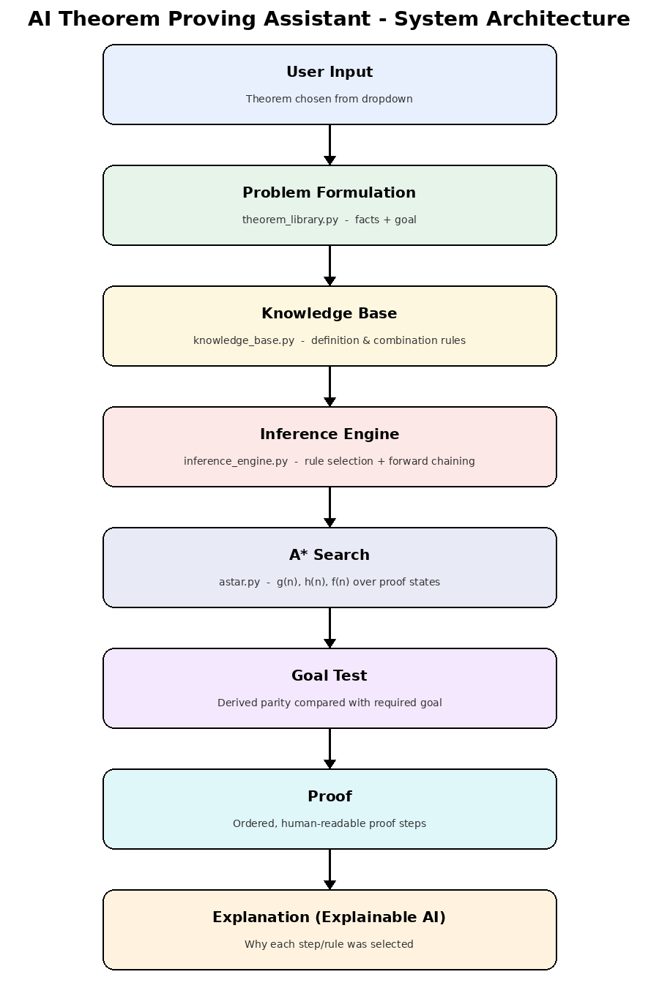
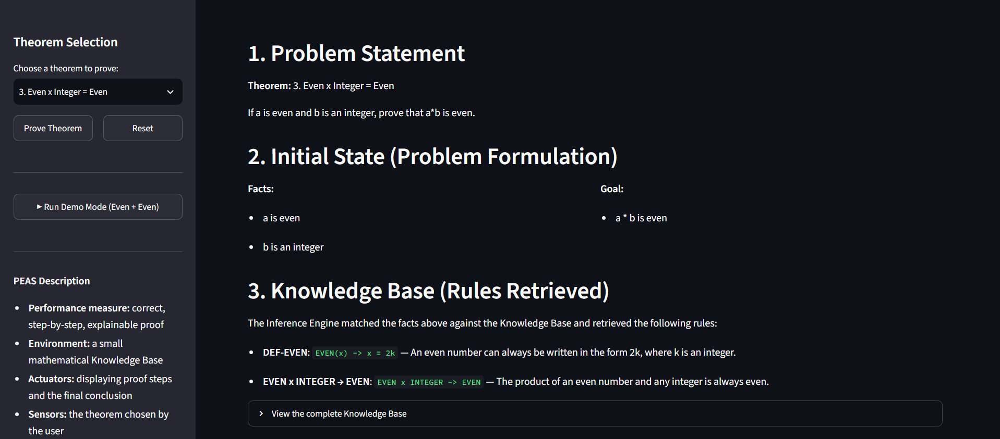
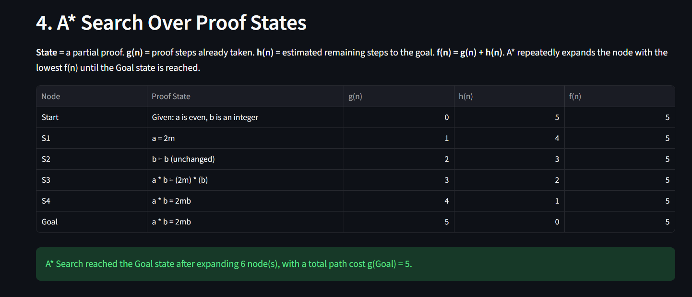
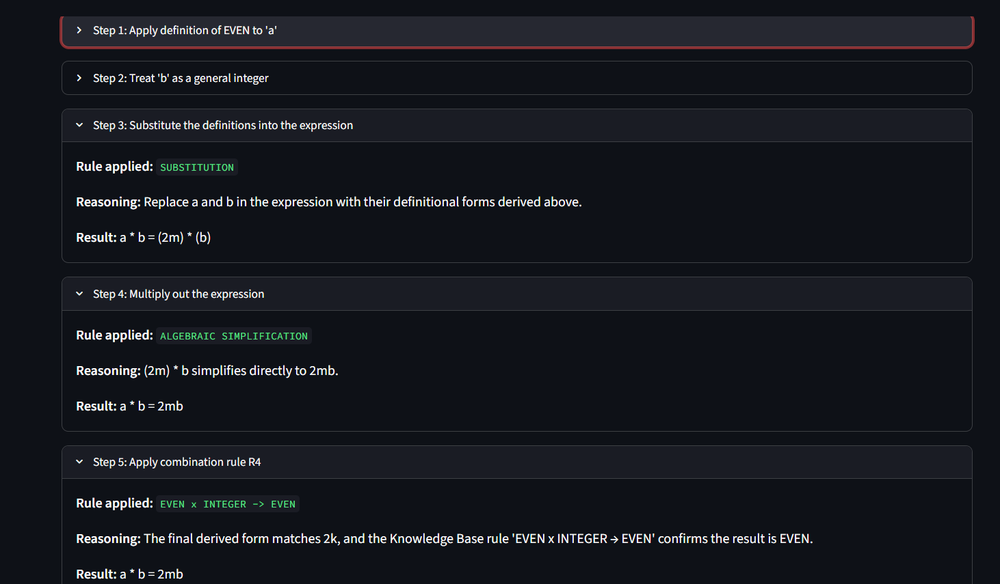
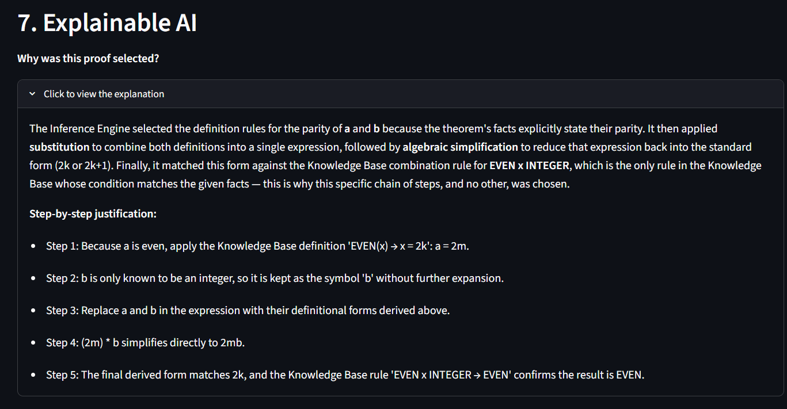

# AI Theorem Proving Assistant

A Knowledge-Based AI prototype for **Automated Theorem Proving**, built as an implementation of a concept drawn from the IEEE paper *"Artificial Intelligence Technology in Mathematical and Engineering Applications"*.



---

## Student Details

| Field | Detail |
|---|---|
| **Name** | Harshit Singh |
| **Class** | T.E. – Information Technology |
| **Roll / ID** | 5024162 |
| **Assignment** | AI CIA-01 PART-05 |
| **Project Title** | AI Theorem Prover |

---

## Table of Contents

1. [Overview](#1-overview)
2. [Reference Paper](#2-reference-paper)
3. [Problem Statement](#3-problem-statement)
4. [Objectives](#4-objectives)
5. [Tech Stack](#5-tech-stack)
6. [Architecture](#6-architecture)
7. [Application Screenshots](#7-application-screenshots)
8. [Working](#8-working)
9. [AI Concepts Demonstrated](#9-ai-concepts-demonstrated)
10. [Supported Theorems](#10-supported-theorems)
11. [Sample Output](#11-sample-output)
12. [Installation](#12-installation)
13. [How to Run](#13-how-to-run)
14. [Project Structure](#14-project-structure)

---

## 1. Overview

The **AI Theorem Proving Assistant** is a small, fully transparent Knowledge-Based Agent that constructs formal mathematical proofs and explains every step it takes.

The reference paper lists **Automated Theorem Proving (ATP)** as one of the four principal application areas of AI in mathematics. Industrial-strength provers such as Lean, Coq and Prover9 are large research systems and cannot be reproduced within a CIA assignment. This project therefore implements a **small, faithful prototype of the same underlying AI machinery** — Knowledge Base, Inference Engine and Heuristic Search — restricted to a well-defined class of theorems: **elementary parity proofs** (properties of even and odd numbers).

What makes the prototype worth studying is that nothing is hard-coded as a finished answer. For any selected theorem the system:

- retrieves rules by **pattern matching** against an explicit Knowledge Base,
- derives the proof step by step through **forward chaining**,
- searches the space of partial proofs with a genuine **A\* Search** implementation (real `heapq` priority queue, open list, closed list, goal test),
- attaches a **plain-language justification** to every single step (Explainable AI), and
- **refuses to fabricate a proof** when the theorem lies outside its Knowledge Base.

The result is a system you can open up and inspect at every layer, rather than a black box that prints a conclusion.

---

## 2. Reference Paper

> **Hamzeh Zureigat**, *"Artificial Intelligence Technology in Mathematical and Engineering Applications"*, 2026 International Conference on Artificial Intelligence for Sustainable Engineering and Innovation (AISEI), pp. 1141–1145.
> **DOI:** 10.1109/AISEI68628.2026.11572910
> ISBN: 979-8-3315-7976-0/26/$31.00 ©2026 IEEE

**Why this paper:** it proposes a four-layer framework for AI (supporting theory → models and algorithms → general techniques → application layer) and identifies four mathematical application areas at the top layer: optimization, symbolic computation, **automated theorem proving**, and numerical analysis.

**How this project maps onto the paper:**

| Paper concept | Implementation in this project |
|---|---|
| Application Layer → Automated Theorem Proving | The entire prototype |
| "A system can check the truth of a mathematical proposition" (Section 3) | Goal test in `inference_engine.py` |
| Symbolic computation — expressions handled analytically, not numerically | Symbolic substitution and simplification (`a + b → 2m + 2n → 2(m+n)`) |
| "Systems which can not only check proofs but also generate ideas" (Section 4) | Forward-chaining derivation of proof steps |
| Explainable AI (XAI), Sections 4 and 5 | Section 7 of the app plus the `reasoning` field on every step |
| Limitations: interpretability, data dependence, generalisation (Section 5) | Addressed directly — the system is fully interpretable, needs no training data, and honestly reports when a theorem is out of scope |

The paper's Section 5 criticism that AI models are often opaque was the direct motivation for making explainability a first-class feature here rather than an afterthought.

---

## 3. Problem Statement

Build a working AI application that demonstrates automated theorem proving, using the AI techniques of **knowledge representation, inference and heuristic search**, such that:

- the domain knowledge is stored **separately** from the reasoning logic,
- each proof is derived, not retrieved,
- each proof step is **explainable** to a human reader, and
- the system's boundaries are stated honestly instead of being papered over.

---

## 4. Objectives

1. Represent elementary number-theory knowledge as an explicit, inspectable **Knowledge Base**.
2. Implement an **Inference Engine** performing the reasoning cycle: Facts → Rule Selection → Inference → New State → Goal Test → Proof.
3. Demonstrate **A\* Search** over the space of partial proofs with real `g(n)`, `h(n)` and `f(n)` computation.
4. Provide **Explainable AI**: for every proof step, explain *why* that rule was selected.
5. Build a clear, demonstrable **Streamlit** UI suitable for a live presentation.
6. Be explicit about the system's **limitations** — never claim a proof outside the Knowledge Base.

---

## 5. Tech Stack

| Layer | Technology | Purpose |
|---|---|---|
| **Language** | Python 3.10+ | Entire implementation |
| **UI Framework** | Streamlit ≥ 1.30 | Interactive web front end (sidebar controls, expandable proof steps, live tables) |
| **Data Display** | pandas ≥ 2.0 | Rendering the A\* search table (`g(n)`, `h(n)`, `f(n)`) |
| **Search Algorithm** | Python `heapq` (standard library) | Priority queue backing the A\* open list |
| **Knowledge Representation** | Python dictionaries in `knowledge_base.py` | Declarative definition and combination rules |
| **Reasoning** | Custom forward-chaining Inference Engine | Rule selection, substitution, simplification, goal test |
| **Typing** | `typing` module | Structured records for proof steps and theorem formulation |

**Deliberate design choice:** no external AI/LLM API, no cloud service, no API keys, no training data and no internet connection are used. Every inference is performed by logic written in this repository, so the AI technique being demonstrated is genuinely implemented rather than outsourced. The application runs fully offline after installation.

---

## 6. Architecture

```
                    ┌─────────────────────┐
                    │      User Input     │
                    │  (Theorem selected) │
                    └──────────┬──────────┘
                               │
                               ▼
                    ┌─────────────────────┐
                    │ Problem Formulation │   theorem_library.py
                    │  Facts + Goal       │
                    └──────────┬──────────┘
                               │
                               ▼
                    ┌─────────────────────┐
                    │   Knowledge Base    │   knowledge_base.py
                    │ Definition rules +  │   (declarative only,
                    │ Combination rules   │    no control logic)
                    └──────────┬──────────┘
                               │
                               ▼
                    ┌─────────────────────┐
                    │  Inference Engine   │   inference_engine.py
                    │ Forward chaining    │
                    └──────────┬──────────┘
                               │
                               ▼
                    ┌─────────────────────┐
                    │     A* Search       │   astar.py
                    │ g(n) + h(n) = f(n)  │
                    └──────────┬──────────┘
                               │
                               ▼
                    ┌─────────────────────┐
                    │     Goal Test       │
                    └──────────┬──────────┘
                               │
                 ┌─────────────┴─────────────┐
                 ▼                           ▼
        ┌────────────────┐         ┌──────────────────┐
        │     Proof      │         │  UNSUPPORTED —   │
        │   (PROVED)     │         │  honest refusal  │
        └────────┬───────┘         └──────────────────┘
                 │
                 ▼
        ┌────────────────────┐
        │ Explainable AI     │   reasoning field per step
        │ (why this path?)   │   + Section 7 narrative
        └────────────────────┘
```

**Separation of concerns** is the guiding principle: `knowledge_base.py` stores *what is known*, `inference_engine.py` decides *how to reason*, `astar.py` decides *which state to expand next*, and `app.py` handles *presentation only*. None of these four responsibilities leaks into the others, which is why the Knowledge Base can be extended with new rules without touching the reasoning or search code.

See `assets/architecture.png` for the rendered diagram (also shown inside the app in Section 8).

### Knowledge Base contents

**Definition rules**
```
EVEN(x) -> x = 2k
ODD(x)  -> x = 2k + 1
```

**Combination rules**
```
R1: EVEN + EVEN     -> EVEN
R2: ODD  + ODD      -> EVEN
R3: EVEN + ODD      -> ODD
R4: EVEN x INTEGER  -> EVEN
R5: ODD  x ODD      -> ODD
```

The Inference Engine queries this table by pattern matching on `(parity_a, operator, parity_b)`. If no rule matches, the engine returns `UNSUPPORTED` — it never guesses.

---

## 7. Application Screenshots

### 7.1 Main Interface — Problem Statement, Initial State and Knowledge Base

The sidebar carries theorem selection, the Prove/Reset controls, Demo Mode and the PEAS description. The main panel opens with the problem statement, the formulated initial state (facts and goal), and the rules the Inference Engine retrieved from the Knowledge Base for this specific theorem.



### 7.2 A\* Search Over Proof States

Each row is a node in the search. `g(n)` is the number of proof steps already taken, `h(n)` the estimated steps remaining, and `f(n) = g(n) + h(n)`. A\* repeatedly expands the lowest-`f(n)` node until the Goal state is reached.



### 7.3 Proof Steps — Rule, Reasoning and Result

Every step is an expandable record showing the rule applied, the reasoning behind selecting it, and the resulting derived state. Nothing is presented as a single opaque paragraph.



### 7.4 Explainable AI

Section 7 explains in plain language why this particular chain of rules — and no other — was selected, followed by a step-by-step justification list.



---

## 8. Working

### Step 1 — Problem Formulation (`theorem_library.py`)

The selected theorem is expressed in the standard Problem-Solving Agent form:

- **Initial State** — the given facts, e.g. `["a is even", "b is an integer"]`
- **Goal** — what must be proved, e.g. `"a * b is even"`
- **Operators** — rule applications supplied by the Inference Engine

Each theorem is stored as a structured record (`var_a_parity`, `operator`, `var_b_parity`, `facts`, `goal`, `goal_type`), so the downstream components operate on it **generically** rather than through separate hard-coded branches per theorem.

### Step 2 — Knowledge Retrieval (`knowledge_base.py`)

The engine pattern-matches the theorem's facts against the Knowledge Base and pulls out only the applicable rules: the definition rule for each variable's parity, plus the one combination rule whose condition matches `(parity_a, operator, parity_b)`.

### Step 3 — Inference (`inference_engine.py`)

The classic forward-chaining cycle runs:

```
Facts → Rule Selection → Inference → New State → Goal Test → Proof
```

1. Read the initial facts.
2. Apply the **definition rule** to each variable (e.g. `a = 2m`).
3. **Substitute** the definitions into the theorem's expression (`a + b` or `a * b`).
4. **Algebraically simplify** — expand and factor to return the expression to canonical form `2k` or `2k + 1`.
5. **Match** the simplified form against a combination rule in the Knowledge Base.
6. **Goal test** — does the derived parity equal the theorem's required goal type?
7. Return the proof steps, final conclusion, status (`PROVED` / `NOT_PROVED` / `UNSUPPORTED`), and step count.

Each step is emitted as a structured record: `step_no`, `action`, `rule_used`, `reasoning`, `result`.

### Step 4 — A\* Search (`astar.py`)

The search space is defined as:

- **State** — a partial proof (one node per derived proof state)
- **Action** — applying the next inference rule
- **g(n)** — proof steps already taken
- **h(n)** — estimated steps remaining to the goal
- **f(n)** — `g(n) + h(n)`

The implementation uses a genuine `heapq` priority queue, an open list, a closed (visited) list and an explicit goal test. It is **not** a table of pre-written numbers. Because this small Knowledge Base yields exactly one reasoning path per theorem, the search graph is a chain, so A\* confirms that the single available path is optimal — `f(n)` stays constant throughout, which is precisely the signature of a **consistent and admissible** heuristic.

### Step 5 — Explanation (Explainable AI)

Every step carries its own `reasoning` string, and Section 7 of the app synthesises these into a narrative explaining why this chain of rules was selected over any other: because it is the only sequence whose preconditions match the given facts.

### Step 6 — Limitation Handling

If no Knowledge Base rule matches (the "Prime + Prime" option), the engine returns `UNSUPPORTED` and the UI reports this honestly rather than fabricating a proof.

---

## 9. AI Concepts Demonstrated

| Concept | Where it appears |
|---|---|
| Knowledge-Based Agent | Overall system design |
| Knowledge Base | `knowledge_base.py` |
| Inference Engine | `inference_engine.py` |
| Forward Chaining | Reasoning cycle in `inference_engine.py` |
| Problem Formulation | `theorem_library.py` (facts, goal, operators) |
| Goal-Based Agent | Goal test in the Inference Engine |
| Problem-Solving Agent | Full pipeline in `app.py` |
| Heuristic / A\* Search | `astar.py` — `g(n)`, `h(n)`, `f(n)`, admissibility |
| Performance Measure | Correct, step-by-step, explainable proof |
| PEAS Description | Shown in the app sidebar |
| Explainable AI | Section 7 of the app + `reasoning` on every step |

### PEAS Description

| Element | Value |
|---|---|
| **Performance measure** | Correct, step-by-step, explainable proof |
| **Environment** | A small mathematical Knowledge Base |
| **Actuators** | Displaying proof steps and the final conclusion |
| **Sensors** | The theorem chosen by the user |

---

## 10. Supported Theorems

| # | Theorem | Goal | Rule Used |
|---|---|---|---|
| 1 | If a and b are even, prove `a + b` is even | EVEN | R1: EVEN + EVEN → EVEN |
| 2 | If a and b are odd, prove `a + b` is even | EVEN | R2: ODD + ODD → EVEN |
| 3 | If a is even and b is an integer, prove `a · b` is even | EVEN | R4: EVEN × INTEGER → EVEN |
| 4 | If a and b are odd, prove `a · b` is odd | ODD | R5: ODD × ODD → ODD |
| 5 | If a is even and b is odd, prove `a + b` is odd | ODD | R3: EVEN + ODD → ODD |
| 6 | Prime + Prime = ? | — | **None — demonstrates limitation handling** |

Option 6 is included deliberately: it is covered by no rule, so the app reports this honestly instead of inventing a proof.

---

## 11. Sample Output

### Example A — Theorem 3: *Even × Integer = Even* (the run shown in the screenshots)

**Problem Statement**
> If `a` is even and `b` is an integer, prove that `a * b` is even.

**Initial State**

| Facts | Goal |
|---|---|
| a is even | a \* b is even |
| b is an integer | |

**Knowledge Base rules retrieved**

```
DEF-EVEN:               EVEN(x) -> x = 2k
EVEN x INTEGER -> EVEN: EVEN x INTEGER -> EVEN
```

**A\* Search over proof states**

| Node | Proof State | g(n) | h(n) | f(n) |
|---|---|---|---|---|
| Start | Given: a is even, b is an integer | 0 | 5 | 5 |
| S1 | a = 2m | 1 | 4 | 5 |
| S2 | b = b (unchanged) | 2 | 3 | 5 |
| S3 | a \* b = (2m) \* (b) | 3 | 2 | 5 |
| S4 | a \* b = 2mb | 4 | 1 | 5 |
| Goal | a \* b = 2mb | 5 | 0 | 5 |

> A\* Search reached the Goal state after expanding 6 node(s), with a total path cost g(Goal) = 5.

**Proof Steps**

| # | Action | Rule Applied | Result |
|---|---|---|---|
| 1 | Apply definition of EVEN to 'a' | `DEF-EVEN` | a = 2m |
| 2 | Treat 'b' as a general integer | — | b = b |
| 3 | Substitute the definitions into the expression | `SUBSTITUTION` | a \* b = (2m) \* (b) |
| 4 | Multiply out the expression | `ALGEBRAIC SIMPLIFICATION` | a \* b = 2mb |
| 5 | Apply combination rule R4 | `EVEN x INTEGER -> EVEN` | a \* b = 2mb |

**Final Result:** ✓ **THEOREM PROVED** — `a * b` is EVEN, since it has the form `2k` with `k = mb`.

**Explainable AI output**

> The Inference Engine selected the definition rules for the parity of **a** and **b** because the theorem's facts explicitly state their parity. It then applied **substitution** to combine both definitions into a single expression, followed by **algebraic simplification** to reduce that expression back into the standard form (`2k` or `2k+1`). Finally, it matched this form against the Knowledge Base combination rule for **EVEN × INTEGER**, which is the only rule in the Knowledge Base whose condition matches the given facts — this is why this specific chain of steps, and no other, was chosen.

### Example B — Theorem 1: *Even + Even = Even*

| Node | Proof State | g(n) | h(n) | f(n) |
|---|---|---|---|---|
| Start | Given: a is even, b is even | 0 | 5 | 5 |
| S1 | a = 2m | 1 | 4 | 5 |
| S2 | b = 2n | 2 | 3 | 5 |
| S3 | a + b = 2m + 2n | 3 | 2 | 5 |
| S4 | a + b = 2(m+n) | 4 | 1 | 5 |
| Goal | a + b = 2(m+n) | 5 | 0 | 5 |

**Final Result:** ✓ **THEOREM PROVED** — `a + b = 2(m+n)`, which has the form `2k`, hence even.

### Example C — Option 6: *Prime + Prime* (limitation handling)

> ⚠ **Unable to prove this theorem with the current knowledge base.**
> No rule in the Knowledge Base matches the given facts. The system reports this rather than producing an unsupported conclusion.

---

## 12. Installation

**Requirements:** Python 3.10 or later.

```bash
git clone <your-repository-url>
cd ai_theorem_prover
pip install -r requirements.txt
```

`requirements.txt`:
```
streamlit>=1.30
pandas>=2.0
```

No API keys, no paid services and no internet connection are required — the application runs fully offline after installation.

---

## 13. How to Run

```bash
streamlit run app.py
```

Streamlit prints a local URL (typically `http://localhost:8501`). Open it in a browser.

Then, in the sidebar, either select a theorem from the dropdown and click **Prove Theorem**, or click **Run Demo Mode (Even + Even)** for an automatic walkthrough. **Reset** clears the screen.

---

## 14. Project Structure

```
ai_theorem_prover/
│
├── app.py                  # Streamlit UI — all 8 sections + Demo Mode
├── knowledge_base.py       # Declarative rules only (no control logic)
├── inference_engine.py     # Forward-chaining reasoning cycle
├── astar.py                # A* search over proof states (heapq)
├── theorem_library.py      # Problem formulation for each theorem
├── requirements.txt
├── README.md
└── assets/
    ├── architecture.png
    ├── screenshot-1-main-ui.png
    ├── screenshot-2-astar-search.png
    ├── screenshot-3-proof-steps.png
    └── screenshot-4-explainable-ai.png
```

| File | Lines | Responsibility |
|---|---|---|
| `app.py` | ~320 | Presentation layer only |
| `inference_engine.py` | ~285 | Reasoning — rule selection, substitution, simplification, goal test |
| `knowledge_base.py` | ~142 | Declarative knowledge |
| `astar.py` | ~126 | Heuristic search over proof states |
| `theorem_library.py` | ~103 | Problem formulation |

---

## Acknowledgement

Built for **AI CIA-01 Part 05** by **Harshit Singh (T.E. I.T., 5024162)**, based on Hamzeh Zureigat, *"Artificial Intelligence Technology in Mathematical and Engineering Applications"*, AISEI 2026, DOI 10.1109/AISEI68628.2026.11572910.